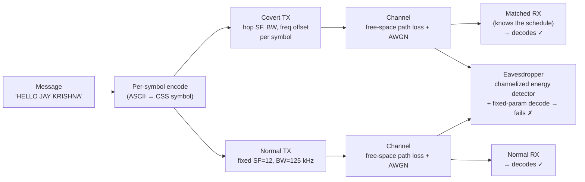

# concealora
Covert LoRa Communication via PHY-Layer Parameter Manipulation and Adaptive Modulation

# Covert Parameter-Hopping LoRa (CSS) — MATLAB Simulation

A MATLAB simulation of a **covert LoRa-style link** built on Chirp Spread Spectrum (CSS),
compared side-by-side against a **standard fixed-parameter LoRa link**. The covert scheme
hops its spreading factor, bandwidth, and carrier offset on a per-symbol schedule so that,
to anyone without that schedule, the transmission looks and measures like noise — while the
intended receiver still decodes the message reliably.

The project quantifies this with detection theory (ROC curves from a channelized energy
detector) rather than just eyeballing a spectrogram, so the "it's stealthy" claim is
*measured*, not asserted.

---

## Table of Contents

- [Goals](#goals)
- [System Overview](#system-overview)
- [Background Concepts](#background-concepts)
- [How Each Concept Is Achieved](#how-each-concept-is-achieved)
- [Running the Simulation](#running-the-simulation)
- [Results — The Nine Figures](#results--the-nine-figures)
- [Honest Caveats](#honest-caveats)
- [File Structure](#file-structure)
- [Possible Extensions](#possible-extensions)

---

## Goals

| # | Goal | Demonstrated by |
|---|------|-----------------|
| G1 | Build a working parameter-hopping CSS transmitter and matched receiver that decodes the message correctly. | Console output, Fig. 2 |
| G2 | Show the covert waveform is spectrally **noise-like** compared to standard LoRa. | Fig. 1 |
| G3 | Expose the hopping mechanism that provides the covertness. | Fig. 3 |
| G4 | Characterize the **legitimate** link (range and noise robustness). | Fig. 4, Fig. 5 |
| G5 | Show that interception **fails** for anyone without the hop schedule (Low Probability of Interception, LPI). | Console output |
| G6 | Quantify **Low Probability of Detection (LPD)** against a realistic eavesdropper. | Fig. 7, Fig. 8, Fig. 9 |
| G7 | Analyze how spreading factor trades data rate for robustness. | Fig. 6 |

Two distinct properties are targeted, and they are **not** the same thing:

- **LPI (can't decode it):** an eavesdropper who captures the signal cannot recover the bits
  because they don't know the per-symbol SF / BW / offset schedule.
- **LPD (can't even find it):** an eavesdropper watching a given radio channel can't reliably
  tell the signal is *present*, because its energy is spread and hopped below the in-band
  noise floor.

---

## System Overview

The simulation runs one message through two parallel pipelines — a covert (hopping) chain and
a normal (fixed-parameter) baseline chain — plus an **eavesdropper** model that only observes a
single standard LoRa channel.



The key asymmetry: the matched receiver shares the hop schedule (the "key"), so it can undo the
chirp for every symbol. The eavesdropper cannot, so both its *decoder* and its *detector* are
degraded.

---

## Background Concepts

### Chirp Spread Spectrum (CSS) and LoRa

LoRa modulates data onto **chirps** — signals whose instantaneous frequency sweeps linearly
across a bandwidth `BW`. A base up-chirp over one symbol period `T = 2^SF / BW` is

```
s(t) = exp( j·2π·( f0·t + (k/2)·t² ) ),   f0 = -BW/2,   k = BW / T
```

Data is carried by a **cyclic frequency shift** of that chirp. A symbol value `m` (one of
`2^SF` possibilities) shifts the chirp by `m·BW / 2^SF`. Because the whole `2^SF`-point symbol
alphabet is packed into one chirp, CSS spreads a small amount of information over a wide
bandwidth — that spreading is what gives it processing gain and lets it work below the noise
floor.

### Spreading Factor (SF) and Bandwidth (BW)

- **SF** sets the symbol length (`2^SF` chips). Higher SF → longer symbols → more processing
  gain and better noise robustness, but lower data rate.
- **BW** sets how wide the chirp sweeps. Together `SF` and `BW` set the symbol duration and the
  time-bandwidth product.

### Demodulation by De-chirping

The receiver multiplies the incoming symbol by a **reference down-chirp** (the conjugate of the
base up-chirp). This collapses the swept chirp into a single tone whose frequency encodes the
symbol; an FFT then shows a sharp peak whose bin index gives the decoded value. This only works
if the receiver uses the *matching* SF and BW — which is the whole point.

### The Channel

Each received signal is attenuated by **free-space path loss**,
`PL(d) = (4π·d·fc / c)²`, and then corrupted by **additive white Gaussian noise (AWGN)**.
Distance therefore controls both the legitimate link SNR and how detectable the signal is to an
eavesdropper.

### Detection Theory: the Energy Detector and the ROC

An eavesdropper who can't decode a signal can still try to **detect its presence** with a
**radiometer** (energy detector): integrate received energy in a band and compare it to a
threshold. Its performance is summarized by a **Receiver Operating Characteristic (ROC)** curve —
probability of detection (`Pd`) versus probability of false alarm (`Pfa`). A curve that hugs the
top-left corner means "easy to detect"; a curve sitting on the diagonal means "no better than a
coin flip." This is the honest, standard way to measure covertness.

---

## How Each Concept Is Achieved

| Concept | Implementation in `covert_lora.m` |
|---|---|
| CSS chirp | `exp(1j*2*pi*(f0*t + (k_chirp/2)*t.^2))` built per symbol. |
| Symbol encoding | `mod(ascii_val, 2^SF)` then a cyclic shift `exp(1j*2*pi*(sym*BW/2^SF)*t)`. |
| **Parameter hopping** | `SF_seq`, `BW_seq`, `freq_offset_seq` drawn per symbol with a seeded RNG — this sequence *is* the shared key. |
| Covert frequency offset | An extra `exp(1j*2*pi*freq_offset*t)` term (±5 kHz) that further smears the signal off the nominal channel center. |
| Channel | `pathloss = @(d) (4*pi*d*fc/c).^2` plus complex AWGN scaled by a single `noise_power`. |
| Matched RX | Per symbol: undo the offset, multiply by the reference down-chirp for that symbol's SF/BW, take the FFT peak. |
| **Interception failure (LPI)** | A fixed-parameter (SF=12, BW=125 kHz) receiver is run on the covert signal → outputs garbage, because it uses the wrong dechirp for every symbol. |
| **Detection analysis (LPD)** | A **channelized energy detector** (`band_energy`) integrates energy only inside a standard 125 kHz LoRa channel; `collect_stats` runs a Monte-Carlo sweep to build ROC / Pd curves. |

A deliberate design choice: the detector is **channelized**, not wideband. Both waveforms are
constant-envelope, so they carry the *same total power* — a wideband radiometer would see them
equally. The covert advantage only appears to a detector watching a *specific* channel, because
the hopping/spreading pushes energy out of that channel. Modeling the channelized detector is
what makes the LPD result meaningful rather than flattering.

---

## Running the Simulation

**Requirements:** MATLAB with the Signal Processing Toolbox (used only for `spectrogram`; the
detector itself uses base `fft`).

```matlab
>> covert_lora
```

The script prints the link distance, measured SNR, and the four decode results (covert→covert,
normal→normal, covert→normal-eavesdropper, and the auto-picked eavesdropper distance), then
produces the nine figures below.

### Exporting the figures

The figures are generated at runtime. To save them as the image files this README references,
append:

```matlab
if ~exist('figures','dir'); mkdir figures; end
figs = findobj('Type','figure');
for f = figs'
    exportgraphics(f, sprintf('figures/fig_%02d.png', f.Number), 'Resolution', 150);
end
```

---

## Results — The Nine Figures

> Figure numbers below match the order the script creates them.

### Fig. 1 — Spectrogram: Normal vs Covert  ·  *Goal G2*


**What it shows.** Two waterfalls of the *received* signal. The normal LoRa plot shows the
classic diagonal chirp streaks confined to a fixed 125 kHz channel. The covert plot shows energy
smeared across time and frequency with no repeating structure.

**Why it's useful.** This is the first-glance evidence of spectral whitening: an analyst
scanning a spectrum waterfall would instantly recognize the normal LoRa chirps, but sees nothing
obviously structured for the covert signal. It motivates the rest of the project — but note it's
only qualitative, which is exactly why the ROC figures later put a number on it.

---

### Fig. 2 — Time Domain: TX vs RX (raw and normalized)  ·  *Goal G1, G4*


**What it shows.** Top subplot: the transmitted waveform against the received one at true
amplitude — the received signal is tiny and noise-riddled after path loss. Bottom subplot: the
same two signals normalized, revealing that the underlying chirp structure survives the channel.

**Why it's useful.** It's the sanity check that the link physically works end-to-end, and it
makes the covert story concrete: the received signal sits close to the noise level (top), yet
the structure is still recoverable by a matched receiver (bottom). The two original overlapping
time-domain plots are merged here into one figure to avoid redundancy.

---

### Fig. 3 — Parameter Hopping (SF and BW per symbol)  ·  *Goal G3*


**What it shows.** The spreading factor and bandwidth actually used for each symbol index,
jumping around across the message.

**Why it's useful.** This is the covert mechanism made visible — the sequence plotted here is
the shared secret. An eavesdropper who doesn't know it can't align a matched dechirp for any
symbol, which is the root cause of both the interception failure (G5) and the reduced
detectability (G6).

---

### Fig. 4 — Intended Link: Distance vs SNR  ·  *Goal G4*


**What it shows.** Received SNR at the *intended* receiver as a function of TX–RX distance,
following the free-space path-loss law.

**Why it's useful.** It characterizes the legitimate link budget: how SNR falls off with range,
which sets the practical operating distance. It grounds the whole simulation in a physical
propagation model rather than an abstract SNR knob.

---

### Fig. 5 — SNR vs Decoding Success (with error bars)  ·  *Goal G4*


**What it shows.** A Monte-Carlo "waterfall": the probability that the *entire message* decodes
correctly as a function of SNR, with ±1 standard-error (binomial) bars from 50 trials per point.

**Why it's useful.** It quantifies robustness — the SNR region where the matched receiver
reliably recovers the message. The error bars are the honest addition: they show how much of the
curve's shape is real versus Monte-Carlo noise, instead of presenting a single deterministic-looking
line.

---

### Fig. 6 — Decode Accuracy by Spreading Factor  ·  *Goal G7*


**What it shows.** Per-*symbol* decode accuracy versus SNR, drawn as one curve per spreading
factor present in the hop schedule.

**Why it's useful.** It exposes the core CSS trade-off that was invisible in the aggregate
message-level curve: higher SF symbols decode correctly at lower SNR (more processing gain) at
the cost of a longer symbol / lower rate. This validates that the simulated processing gain
behaves as CSS theory predicts and explains *why* adaptive spreading factor is worth having.

---

### Fig. 7 — Eavesdropper ROC: Normal vs Covert  ·  *Goal G6*


**What it shows.** ROC curves (Pd vs Pfa) for a channelized energy detector trying to detect the
signal in a standard 125 kHz LoRa channel, for both the normal and covert waveforms, with the
chance diagonal for reference. The eavesdropper distance is auto-calibrated so the normal
waveform sits in an informative detection regime.

**Why it's useful.** This is the quantitative heart of the LPD claim. The normal curve bows
toward the top-left (easy to detect at almost any operating point); the covert curve sits much
closer to the diagonal (detection barely better than guessing). It converts "looks noise-like"
into a real detection-theory number.

---

### Fig. 8 — Detection Probability vs Eavesdropper Distance  ·  *Goal G6*


**What it shows.** At a fixed 1% false-alarm rate, the probability that the energy detector flags
the signal, as a function of how far the eavesdropper is from the transmitter — for both
waveforms.

**Why it's useful.** It translates the ROC into an operational picture: the covert signal's
detection probability collapses at a much shorter range than the normal signal's. In other
words, an eavesdropper has to get substantially closer to reliably notice the covert
transmission — a directly meaningful measure of "how stealthy."

---

### Fig. 9 — TX Power vs Detection Probability  ·  *Goal G6*


**What it shows.** Detection probability (fixed 1% false-alarm rate) as transmit power is swept
across five orders of magnitude, for both waveforms, at the fixed eavesdropper distance.

**Why it's useful.** It quantifies the **power headroom** the covert scheme buys: to reach the
same detection probability, the covert signal must transmit at meaningfully higher power than the
normal one. Practically, that means the covert link can push power up (extending range or margin)
while staying below the eavesdropper's detection — replacing the original "peak-FFT" hand-wave
with a proper Pd-based metric.

---

## Honest Caveats

- **Covertness is against a *channelized* detector.** Because both waveforms are
  constant-envelope with equal received power, a *wideband* radiometer would detect them equally.
  The LPD advantage shown here is specifically against a detector watching a single LoRa channel,
  which is the realistic threat model for a standard-LoRa eavesdropper.
- **Covertness ≠ encryption.** LPI here means an eavesdropper can't align the dechirp without the
  hop schedule. It is not a cryptographic guarantee; it's spread-spectrum obscurity.
- **Idealized channel.** Free-space path loss + AWGN only — no multipath, fading, hardware
  impairments, or synchronization error. Real hardware would need timing/CFO recovery that the
  matched receiver here gets for free.
- **Detector is a plain energy detector.** A more capable eavesdropper (cyclostationary feature
  detector, wideband channelizer bank) would do better; the results here bound detectability
  against a common baseline detector, not the strongest possible one.

---

## File Structure

```
.
├── covert_lora.m      % full simulation: TX, channel, RX, baseline, detector, all 9 figures
├── figures/           % exported PNGs (generated by the export snippet above)
└── README.md
```

---

## Possible Extensions

- Swap the energy detector for a **cyclostationary detector** and re-run the ROC to test a
  stronger eavesdropper.
- Add **multipath / Rayleigh fading** and realistic timing/CFO recovery to the matched receiver.
- Sweep the **hop-set size** (how many SF/BW values are in play) and plot its effect on the ROC —
  quantifying how much diversity buys how much stealth.
- Replace the free-space model with a real path-loss/shadowing model and map detection range on
  an actual geometry.