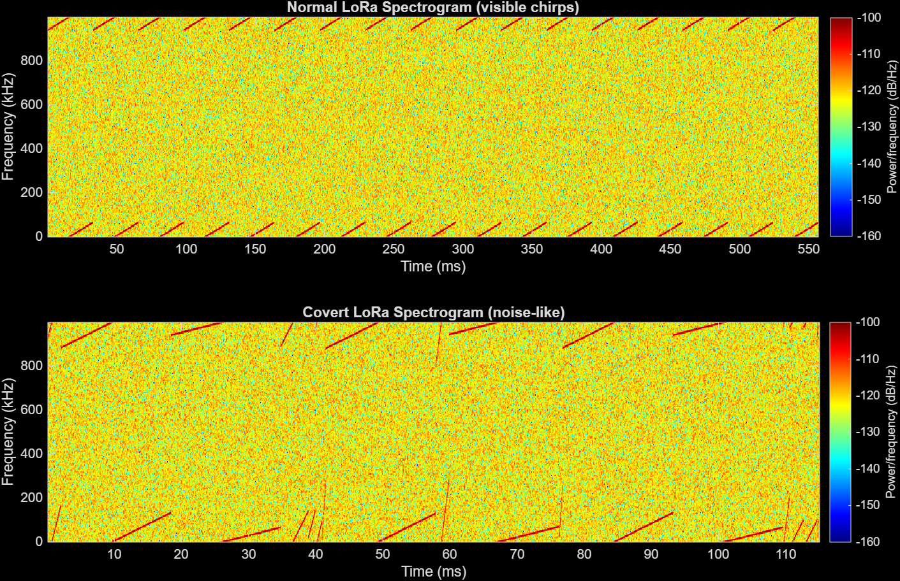
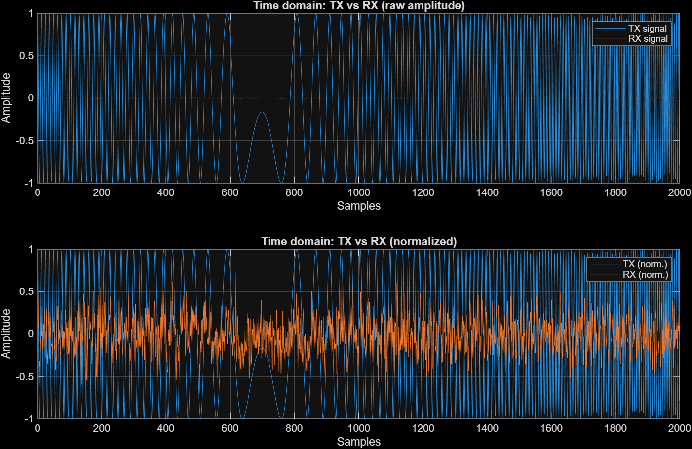
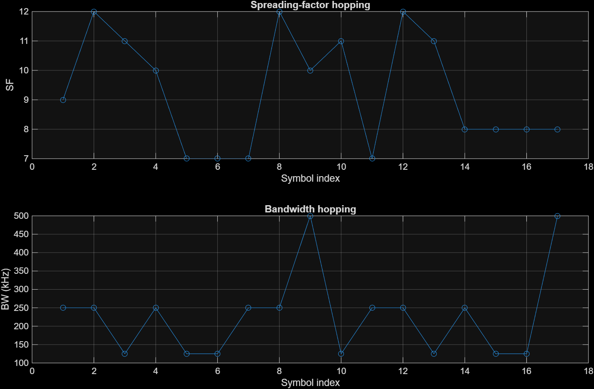
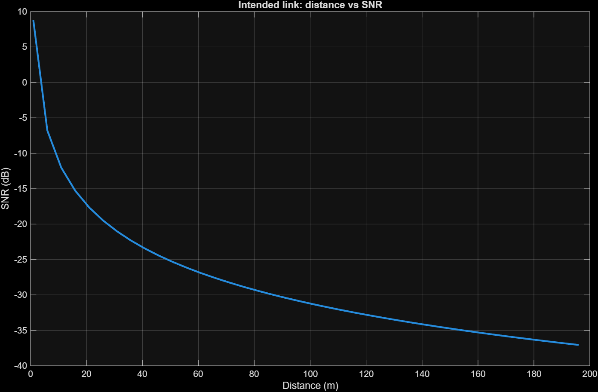
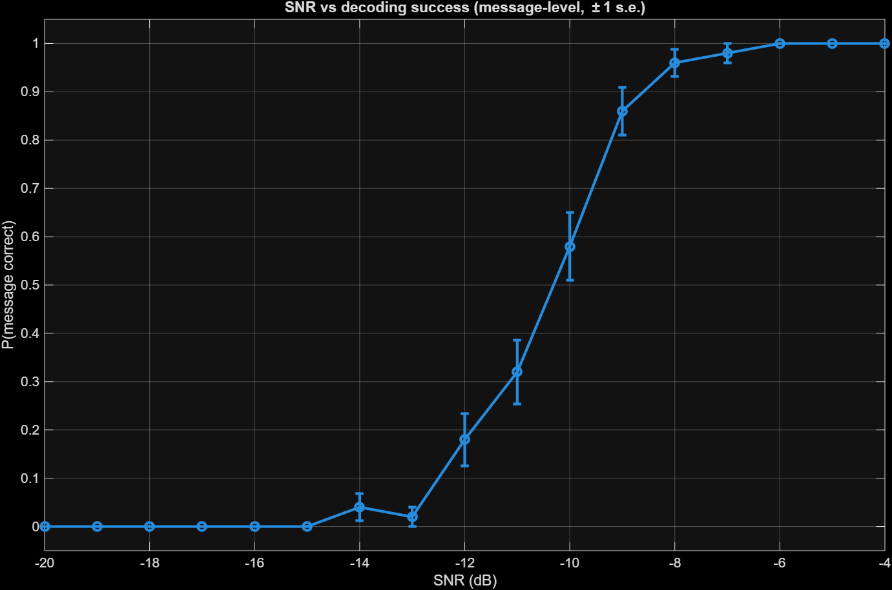
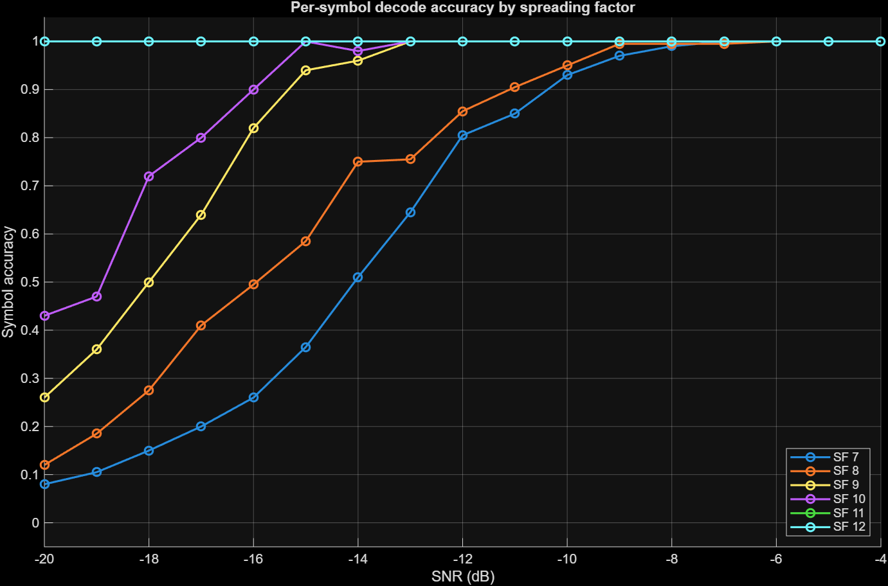
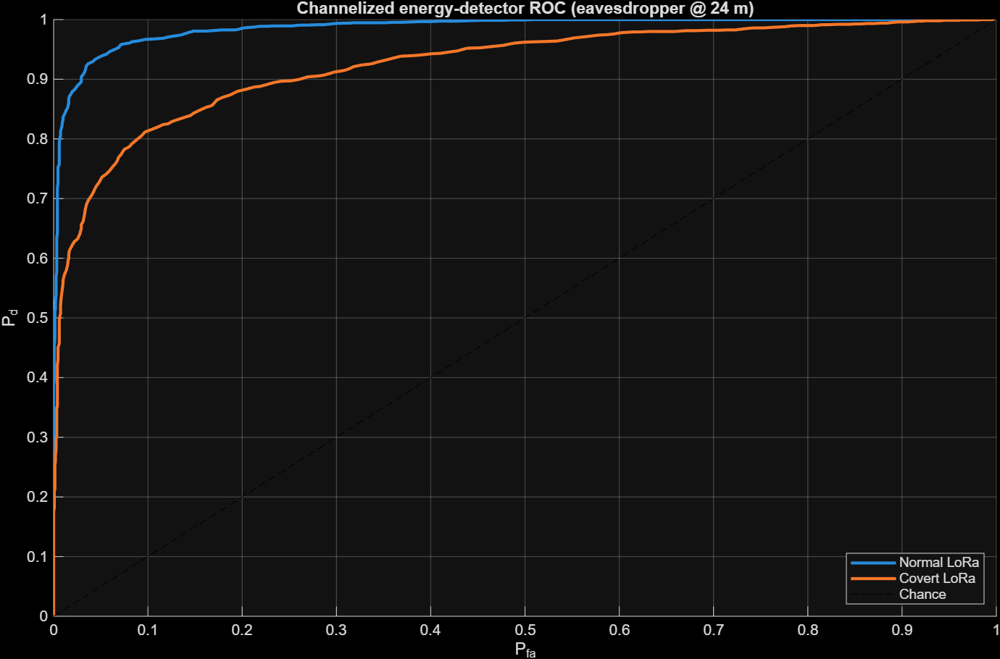
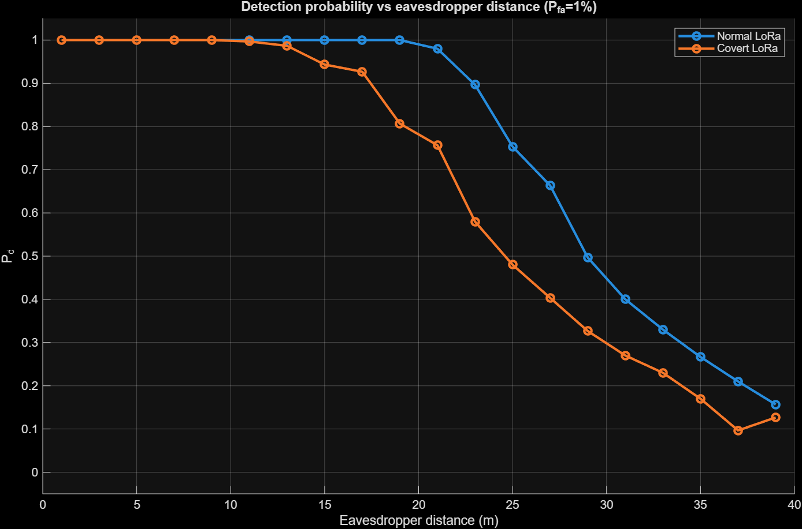
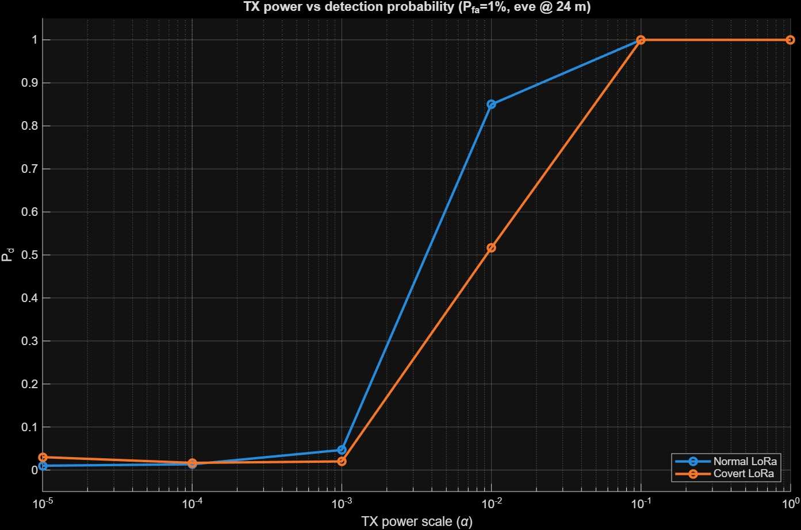

# ConceaLora

### A concept for deterministic parameter-hopping with LoRa

ConceaLora is a MATLAB simulation exploring the idea of changing LoRa's spreading factor (SF) and bandwidth (BW) from symbol to symbol using a deterministic pseudo-random number generator (PRNG).

The transmitter and receiver share the same PRNG seed, so both generate the same sequence of parameters without having to explicitly transmit that sequence. Each symbol can therefore use a different SF/BW combination and, in this simulation, a small carrier-frequency offset as well.

The interesting part is that this idea does **not require a dedicated PHY-layer modulation toolkit with a specially selected SNR**. The hopping happens at the level of parameters already supported by LoRa. In principle, the same approach can therefore be implemented on a LoRa-supported device without requiring a specialized modulation stack.

The project is mainly a **PHY-layer concept and simulation**, rather than a finished LoRa protocol or hardware implementation.

## How it works

The simulation sends the same message through two links:

- a normal LoRa-style link using fixed parameters
- a parameter-hopping link where SF, BW and frequency offset change for every symbol

The hopping sequence is generated deterministically from a shared seed:

```text
shared seed
    ↓
deterministic PRNG
    ↓
SF / BW / frequency-offset sequence
    ↓
┌─────────────────┐
│ Symbol 1        │ → SF?, BW?
│ Symbol 2        │ → SF?, BW?
│ Symbol 3        │ → SF?, BW?
│ ...             │
└─────────────────┘
```

The receiver uses the same seed, generates the same sequence, and knows which parameters to use when de-chirping each symbol.

An observer that assumes the transmission is using a normal fixed LoRa configuration doesn't have that information, so its decoder is no longer matched to the waveform.

The simulation also includes an eavesdropper using a **channelized energy detector** to see how much of the signal remains inside a conventional 125 kHz LoRa channel.

## Why change SF and BW?

SF and BW aren't just arbitrary parameters. They directly affect how LoRa symbols behave.

A higher spreading factor gives more processing gain and generally makes symbols easier to recover at low SNR, but it also makes them longer. Bandwidth changes the chirp rate and symbol duration as well.

By changing these parameters between symbols, the signal doesn't have one fixed time-frequency structure for the entire transmission.

That's the part this project is interested in: **using LoRa's existing PHY parameters as part of a deterministic hopping scheme.**

## The simulation

The MATLAB simulation includes:

- CSS chirp generation
- per-symbol SF/BW selection
- deterministic parameter generation using a seeded PRNG
- optional frequency offset hopping
- free-space path loss
- AWGN
- a matched receiver that knows the hopping sequence
- a fixed-parameter receiver that doesn't
- channelized energy detection
- Monte-Carlo detection experiments
- ROC curves and detection-probability plots

The normal link uses a fixed `SF12 / 125 kHz` configuration as the baseline.

The hopping link changes its parameters on a per-symbol basis.

## What I wanted to see

There are two different questions here.

**Can the intended receiver still decode the message?**

Since it knows the parameter sequence, it can use the correct SF and BW for every symbol.

**What happens if the receiver doesn't know the sequence?**

A receiver expecting a conventional fixed LoRa waveform is no longer synchronized with the parameters being used, so its de-chirping and decoding fail.

The simulation also looks at a slightly different problem: whether an observer watching a **single conventional LoRa channel** can detect the transmission from its energy.

That's where the detection experiments and ROC curves come in.

## Results

### Spectrogram



The fixed LoRa waveform has the expected repeating chirp structure inside its channel. With parameter hopping, that structure becomes much less consistent in both time and frequency.

This is useful as a visual sanity check, although a spectrogram by itself isn't enough to claim that something is difficult to detect.

### Time-domain waveform



The received signal after path loss and noise can be very small compared with the transmitted waveform, but the matched receiver is still able to recover the underlying chirp structure.

### Parameter hopping



This shows the SF and BW selected for each symbol.

The important part isn't any particular sequence of values. It's that the transmitter and receiver generate the **same sequence deterministically** from the shared seed because we use random functions that are PRNGs.

### Link behaviour



The simulation also measures how received SNR changes with distance using a free-space path-loss model.



A Monte-Carlo sweep is used to see how reliably the matched receiver decodes the complete message at different SNRs.

### Spreading factor



The SF curves show the expected trade-off between spreading factor and SNR. Higher SF values reach high decoding accuracy at lower SNR, while lower SFs require a stronger signal. This is useful for the hopping scheme because it shows that changing SF per symbol isn't just random variation—the different SFs retain their expected decoding characteristics.

### Detection



The eavesdropper uses an energy detector looking specifically at a conventional 125 kHz channel.

The ROC curves show the same effect from a detection-theory perspective. The normal LoRa waveform is much easier for the channelized detector to identify, while the hopping waveform stays closer to the chance line, especially at low false-alarm rates. The important point is that this result applies specifically to the single-channel energy detector used in the simulation.



At a fixed false-alarm rate of 1%, the covert LoRa waveform becomes harder to detect as the eavesdropper moves away. Its detection probability drops faster than the normal LoRa waveform, showing how parameter hopping reduces the energy visible inside the monitored channel.



Finally, transmit power is swept to see how detection probability changes.

## Running it

You need MATLAB. The `spectrogram` visualization uses the Signal Processing Toolbox; the main detector itself uses MATLAB's regular FFT functionality.

Run:

```matlab
covert_lora
```

The script runs the transmitter, channel, receivers and detection experiments and generates the figures above.

If you want to export the figures:

```matlab
if ~exist('figures','dir')
    mkdir figures
end

figs = findobj('Type','figure');

for f = figs'
    exportgraphics(f, sprintf('figures/fig_%02d.png', f.Number), ...
        'Resolution', 150);
end
```

## The equations

The simulation is built around the usual CSS relationships used by the model.

A base up-chirp is represented as:

```text
s(t) = exp(j·2π·(f₀·t + (k/2)·t²))
```

where:

```text
f₀ = -BW/2
k  = BW/T
T  = 2^SF / BW
```

A symbol `m` is represented as a cyclic frequency shift:

```text
Δf = m·BW / 2^SF
```

with `m` taking one of the `2^SF` possible symbol values.

The free-space path loss used in the simulation is:

```text
PL(d) = (4π·d·f_c / c)²
```

The received signal is then corrupted with additive white Gaussian noise (AWGN).

For detection, the eavesdropper integrates received energy inside the monitored channel and compares it against a threshold. The resulting detector performance is represented using:

```text
Pd = probability of detection
Pfa = probability of false alarm
```

and plotted as ROC curves.

## What this does not do

This project should not be interpreted as a replacement for LoRaWAN security or encryption.

The hopping sequence is generated deterministically from a shared seed, but the simulation does not turn that seed into a cryptographic key or provide a formal security guarantee.

The detection results are also specific to the detector being simulated. The eavesdropper watches a **single 125 kHz LoRa channel** using an energy detector. A wideband or more sophisticated detector could observe the signal differently.

The channel itself is intentionally simple: free-space path loss and AWGN. Real radios would introduce synchronization errors, carrier-frequency offset, multipath, fading and hardware impairments.

Most importantly, this is a simulation of a **PHY-layer parameter-hopping concept**. It demonstrates that a receiver with the same deterministic parameter sequence can follow a changing LoRa waveform, and explores what that change does to a fixed-channel observer. It does not claim that the transmission is invisible or inherently secure.

One practical motivation for the approach is that the hopping can be expressed using parameters already exposed by LoRa-capable radios, rather than requiring a specialized PHY modulation toolkit that operates around a separately chosen SNR.


## Where this could go next

There are a few obvious directions from here:

- test larger and smaller SF/BW hop sets
- compare different deterministic PRNGs and seed/key schemes
- add realistic fading and multipath
- include timing and carrier-frequency synchronization
- test against stronger detection techniques
- eventually move the idea from MATLAB simulation to actual LoRa hardware

For now, the main goal is to explore whether **deterministic per-symbol LoRa parameter hopping is a useful PHY-layer concept**, and to understand the trade-offs that come with it.
